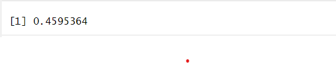

# MVA_Assignment_1


---
title: "MVA Assignment-1"
author: "Deviprasad Saka"
date: "2024-02-15"
output: html_document
---


```{r}
# Provide the file path to CSV file
file_path <- "D:/Multivariate Analysis/Assignment-1/train US new.csv"

# Import the CSV file into R
data <- read.csv(file_path)

# View the imported data
print(data)
```
<!-- -->

```{r}
#Q1: What is the relationship between the Cost_of_Living_Index (independent variable) and
#the Happiness_Score (dependent variable) in regions with varying levels of economic development?

# Load required libraries
library(ggplot2)
library(dplyr)

# Calculate correlation coefficient
correlation <- cor(data$Cost_of_Living_Index, data$Happiness_Score)

# Print correlation coefficient
print(correlation)
```
<!-- -->

```{r}
# Result: Correlation coefficient of 0.4595364 indicates a moderate positive correlation between Cost_of_Living_Index and Happiness_Score, meaning they tend to move together in the same direction to a moderate degree.
```

```{r}
# Plot the correlation
plot(data$Cost_of_Living_Index, data$Happiness_Score,
     xlab = "Cost of Living Index",
     ylab = "Happiness Score",
     main = "Correlation between Cost of Living Index and Happiness Score",
     col = "red")
```
<!-- -->

```{r}
#Q2: How does the availability of green space (Green_Space_Area) 
#correlate with air quality (Air_Quality_Index) in the studied area?


# Calculate the correlation coefficient
correlation <- cor(data$Green_Space_Area, data$Air_Quality_Index)

# Print the correlation coefficient
print(correlation)
```
<!-- -->

```{r}
# Result: A correlation coefficient of -0.4092952 indicates a moderate negative correlation between Green_Space_Area and Air_Quality_Index.
```


```{r}
# Plot the correlation
plot(data$Green_Space_Area, data$Air_Quality_Index,
     xlab = "Green space area",
     ylab = "Air quality",
     main = "Correlation between Green space area and Air quality",
     col = "blue")
```
<!-- -->

