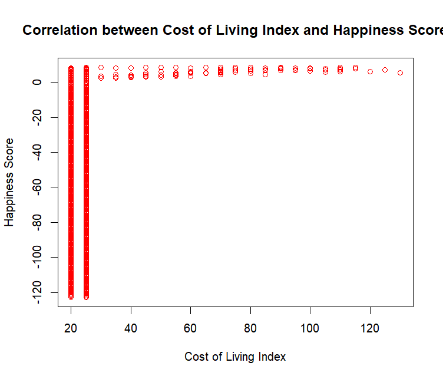
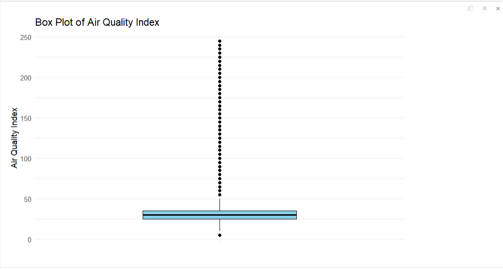

# MVA_Assignment


---
title: "MVA Assignment_1"
author: "Deviprasad Saka"
date: "2024-02-15"
output: html_document
---
1.Ask an important question you want answered?
i. What is the relationship between the Cost_of_Living_Index (independent variable)
and the Happiness_Score (dependent variable) in regions?
ii. How does the availability of green space (Green_Space_Area)
correlate with air quality (Air_Quality_Index) in the studied area?

2.Answer why this question(s) is/are important to you?
i. Cost of Living and Happiness Score Relationship: Knowing the human relationship
kind out of the Cost_of_Living_Index and the Happiness_Score in regions with various
economic. It serves for measuring the availability of common amenities (such as rent, 
doors, water, etc.) that influence the living conditions and mood of the members of society.
This knowledge shall be used for resolve the problem of social inequality and further
improve life standards of all community members irrespective of economic status.

ii. Green Space and Air Quality Correlation: Answering the query on whether Green_Space_Area 
and Air_Quality_Index are connected is necessary for environmental. Green platforms are
among the directions in which the breathing becomes pure again as they suck out pollutants
physically and improve air quality. It has great significance for in making decisions on the
preservation and expansion of green areas to support the healthier living conditions for
negative reasons pollution can affect the health of a person.


```{r}
# Provide the file path to CSV file
file_path <- "D:/Multivariate Analysis/Assignment-1/train US new.csv"

# Import the CSV file into R
data <- read.csv(file_path)

# View the imported data
print(data)
```
<!-- -->


---
3.Find and collect data (need one dependent variable and more than 3 independent variables)?
Dependent variable: Happiness_Score
Independent variables: Decibel_Level, Traffic_Density, Green_Space_Area,
Air_Quality_Index, Cost_of_Living_Index, Healthcare_Index

The Happiness Score is likely to be influenced by factors such as 
noise level (Decibel_Level), traffic density (Traffic_Density), availability of
green spaces (Green_Space_Area), air quality (Air_Quality_Index), cost of living (Cost_of_Living_Index),
and healthcare quality (Healthcare_Index). Therefore, the Happiness Score is the dependent variable,
while the rest are independent variables

4.Describe your data ?
Decibel_Level (Integer): It could be, in fact, that the referred factor is the
indicator of noise level of some specific territory. Decibel level assignment is
the most widespread world-wide; this normally means the louder atmosphere.

Traffic_Density (Character): This variable apparently is about the traffic on the block
in a given area

Green_Space_Area (integer): The alternating green value evidently contains information
on the degree of green space or vegetation cover in the said area. The concept of green 
area could be park, garden, or any natural area availability.

Air_Quality_Index (Integer): Likely, the dispersion of different types of gases is monitored 
through the analysis of atmospheric conditions in a selected area. Air quality index (AQI) is 
a commonly used standardize parameter which conveys the severity of air pollution and the
consequent health issues.

Happiness_Score (Num): That variation just could be an index of the subjectively perceiving 
emotional state or happiness of a particular area. 

Cost_of_Living_Index (Integer): This variable is most likely to be interpreted as the expense
area of a particular locality. It generally higher level considers the issues of a place to live,
food, utilities, car and trips, emergency care.

Healthcare_Index (Integer): The inconstant factor could be both the quality of healthcare or the
ease of access in the specified settings. The main components of a healthcare index may include 
the number of healthcare facilities operating, healthcare professionals available, medical
technology in use and the overall quality of patient outcomes.


---
```{r}
Q1: What is the relationship between the Cost_of_Living_Index (independent variable) and
the Happiness_Score (dependent variable) ?

# Load required libraries
library(ggplot2)
library(dplyr)

# Calculate correlation coefficient
correlation <- cor(data$Cost_of_Living_Index, data$Happiness_Score)

# Print correlation coefficient
print(correlation)
```
<!-- -->

```{r}
Result: Correlation coefficient of 0.4595364 indicates a moderate positive correlation between
Cost_of_Living_Index and Happiness_Score, meaning they tend to move together in the same direction to a moderate degree.
```

```{r}
# Plot the correlation
plot(data$Cost_of_Living_Index, data$Happiness_Score,
     xlab = "Cost of Living Index",
     ylab = "Happiness Score",
     main = "Correlation between Cost of Living Index and Happiness Score",
     col = "red")
```
<!-- -->

```{r}
Q2: How does the availability of green space (Green_Space_Area) 
correlate with air quality (Air_Quality_Index) in the studied area?


# Calculate the correlation coefficient
correlation <- cor(data$Green_Space_Area, data$Air_Quality_Index)

# Print the correlation coefficient
print(correlation)
```
<!-- -->

```{r}
Result: A correlation coefficient of -0.4092952 indicates a moderate negative correlation
 between Green_Space_Area and Air_Quality_Index.
```


```{r}
# Plot the correlation
plot(data$Green_Space_Area, data$Air_Quality_Index,
     xlab = "Green space area",
     ylab = "Air quality",
     main = "Correlation between Green space area and Air quality",
     col = "blue")
```
<!-- -->


----
Title: 'Exploratory Data Analysis (EDA): Visualization'
----

```{r}
# Provide the file path to CSV file
file_path <- "D:/Multivariate Analysis/Assignment-1/train US new.csv"

# Import the CSV file into R
data <- read.csv(file_path)

# View the imported data
print(data)
```

<!-- -->

1. Univariate Analysis:

Question : What is the distribution of Air quality Index?

```{r}
hist(data$Air_Quality_Index)
```

<!-- -->

Visualization: Histogram of Air quality index

The histogram shows the distribution of Air quality Index. It means that most of the Air quality
index falls in the lower ranges, and is distributed to the right. The frequency of AQI between 0-40 is more.


Question :  What is the distribution of Air quality Index in terms of density ploy?
```{r}
plot(density(data$Air_Quality_Index))
```


<!-- -->
Visualization: Density plot of Air quality index

A bandwidth of 1.905 implies a moderate level of smoothing, resulting in a density plot
that is neither overly smooth nor overly sensitive to local variations in the data.
The density plot represents the distribution of the 'Air Quality Index' variable,
with the y-axis showing the density of observations at different values of the index.
With a total of 545 data points contributing to the density estimation, the plot provides
insights into the overall distribution and concentration of air quality index values in the dataset

Bivariate Analysis:

Question : Is there a relationship between Traffic_Density and Air_Quality_Index?

```
library(ggplot2)

ggplot(data, aes(x = Traffic_Density, y = Air_Quality_Index)) +
  stat_summary(fun = mean, geom = "bar", fill = "blue")
```
Visualization: Scatter plot of Traffic_Density and Air_Quality_Index

<!-- -->

From the plot, it can be easily comprehend that the increase in air quality index is proportinal to the traffic density. When the traffic is low, the AQI is also low and when the traffic is very high, the AQI is also increased. 

Question : How Cost_of_Living_Index and Happiness_Score are related with each other.

```{r}

# Calculate correlation coefficient
correlation_coefficient <- cor(data$Cost_of_Living_Index, data$Happiness_Score)
# Plot scatter plot
ggplot(data, aes(x = Cost_of_Living_Index, y = Healthcare_Index)) +
  geom_point(color = "blue") +
  geom_smooth(method = "lm", se = FALSE) +  # Add linear regression line
  labs(title = "Relationship between Cost of Living Index and Happiness Score",
       x = "Cost of Living Index",
       y = "Happiness Score") +
  annotate("text", x = Inf, y = Inf, 
           label = paste("Correlation coefficient:", round(correlation_coefficient, 2)), 
           hjust = 1, vjust = 1, size = 4, color = "red")
```
Visualization: Corelation between Cost_of_Living_Index and Happiness_Score.

<!-- -->

Cost of living index and happiness index show a moderate linear relation in the graph. 
As the happiness score shows growth, the cost of living is also increasing. The relationship is only moderate
as we see that there are few values which show high happiness score with less cost of living index also.
The correlation coefficient is 0.46 indicates a moderate positive association between 
the "Cost_of_Living_Index" and "Happiness_Score" variables, indicating that, on average,
regions or individuals with higher cost of living tend to report higher levels of happiness. 


Multivariate Analysis:

Question : How do levels of environmental factors such as noise pollution (Decibel_Level)
and air quality (Air_Quality_Index) relate to Healthcare_Index ?

```{r}

# Install and load the GGally package
library(GGally)
# Select the relevant variables from your dataset
selected_vars <- c("Decibel_Level", 
                   "Air_Quality_Index", "Healthcare_Index")
# Create a pair plot
pairs(data[selected_vars])
```
<!-- -->

Visualization: Pair_plot of Decibel_Level, Air_Quality_Index & Healthcare_Index

The graph depicts the relationship between Decibel level, air quality index and healthcare index.

1.Decibel level and Air quality index – Here we can see a clear upward trend, as the decibel level
 increase the air quality index values are also increasing.
 
2.Air quality index and healthcare index – As expected, the air quality index and healthcare index
 are very strongly related. Higher the healthcare index, better is the air quality index. As the air
 quality index gets bad, the healthcare index also gets low.
 
3.Decibel level and healthcare index – Decibel levels and healthcare index have a strong 
linear relationship. Healthcare index is low when decibels are high clearly showing that healthcare
 is better in areas with less decibel levels.


# Mean and Variance Analysis:
```{r}
# Provide the file path to CSV file
file_path <- "D:/Multivariate Analysis/Assignment-1/train US new.csv"

# Import the CSV file into R
data <- read.csv(file_path)

# View the imported data
#print(data)
```

```{r}

#Analyzing the univariate mean and variance of the “Air Quality index” variable
library(ggplot2)

# Calculate mean and variance for Air Quality Index
mean_AQI <- mean(data$Air_Quality_Index)
variance_AQI <- var(data$Air_Quality_Index)

print(paste("Mean for Total AQI:", mean_AQI))
print(paste("Variance for Total AQI:", variance_AQI))
```

<!-- -->


Question-1 : How does the mean of Total Air Quality Index readings gives information about Air Quality?
Ans:The mean (average) of Total Air Quality Index readings, which is approximately 38.03, provides
us with a typical or central value representing the air quality across different locations.
This information is crucial for understanding the overall level of air quality and can be used 
for decision-making in various ways. For example, policymakers and public health officials can 
use the mean to assess the general air quality conditions in a region, prioritize areas for 
air quality improvement initiatives, and allocate resources for monitoring and addressing air pollution.

Question-2 : Considering the variance of Total Air Quality Index readings, how does the magnitude 
of variance indicate the spread or variability in air quality across different locations?
Ans: The variance of Total Air Quality Index readings, which is approximately 1317.73, indicates
the spread or variability in air quality across different locations. A higher variance suggests
that the Total Air Quality Index readings are more spread out from each other, with some locations
experiencing significantly higher or lower air quality compared to the mean. This information is
important for developing targeted strategies for air quality management and public health interventions

```{r}

library(ggplot2)

ggplot(data, aes(x = "", y = Air_Quality_Index)) +
  geom_boxplot(width = 0.5,  # Adjust the width of the boxes
               fill = "skyblue", color = "black",  # Set fill and outline color
               notch = FALSE,  # Disable notches
               coef = 1.5) +   # Adjust coefficient for determining whisker length
  labs(title = "Box Plot of Air Quality Index", x = "", y = "Air Quality Index") +
  theme_minimal() +  # Apply a minimal theme for better visual clarity
  theme(axis.text.x = element_blank())  # Remove x-axis labels for better appearance


```

<!-- -->

Based on the plot, the box plot of the Air Quality Index (AQI) indicates the presence of outliers.
The outliers are represented by the extended lines beyond the "whiskers" of the box plot, denoted
by the dot symbols. These symbols suggest the presence of unusually high AQI values that deviate
from the overall pattern of the data. Outliers in the context of a box plot can provide valuable
insights into extreme air quality conditions that may require special attention or investigation. 


```{r}
# Q-Q plot for Air Quality Index
qqnorm(data$Air_Quality_Index, main = "Q-Q Plot of Air Quality Index", col = "blue")  # Adding color
qqline(data$Air_Quality_Index)
```

<!-- -->


The Q-Q plot, or quantile-quantile plot, is a graphical tool used to assess whether a dataset 
follows a certain theoretical distribution, such as the normal distribution. In this specific
case, the Q-Q plot is representing the distribution of the air quality index. Theoretical quantiles
are plotted against sample quantiles, allowing for a visual comparison between the distribution
of the air quality index and the theoretical distribution. This comparison helps in determining
if the air quality index data follows a specific theoretical distribution or if it deviates from it.
From the plot we can clearly observe the outliers.


T.Test:
```{r}
#Data: The analysis was performed on the "Air_Quality_Index" and "Healthcare_Index" variables from the dataset.
# Perform t-test
t_test_result <- t.test(data$Air_Quality_Index, data$Healthcare_Index)

# Print the t-test result
print(t_test_result)
```

<!-- -->


 The result of the t-test between "Air_Quality_Index" and "Healthcare_Index" variables is as follows:

 Test Statistic (t): The calculated t-value is -33.996.

 Degrees of Freedom (df): The degrees of freedom for the t-distribution are approximately 635.25.

 p-value: The p-value is reported as less than 2.2e-16 (essentially zero), indicating strong evidence
 against the null hypothesis. This means that there is a statistically significant difference in the means
 of the two variables.

 Alternative Hypothesis: The alternative hypothesis states that the true difference in means is 
 not equal to zero, which implies that there is a difference in means between "Air_Quality_Index"
 and "Healthcare_Index".

 95% Confidence Interval: The 95% confidence interval for the difference in means is reported
 as (-58.22935, -51.86974). This interval suggests that we are 95% confident that the true difference
 in means between the two variables falls within this range.

 Sample Estimates: The sample mean of "Air_Quality_Index" is 38.03670, and the sample mean of 
 "Healthcare_Index" is 93.08624.

Meaning based on the result:
  
 The p-value is extremely small, indicating strong evidence against the null hypothesis of no difference
 in means between "Air_Quality_Index" and "Healthcare_Index". Therefore, we reject the null hypothesis in
 favor of the alternative hypothesis.
 The negative t-value suggests that the mean of "Healthcare_Index" is significantly higher than the 
 mean of "Air_Quality_Index".
 The 95% confidence interval for the difference in means does not include zero, further supporting the
 conclusion that there is a statistically significant difference in means between the two variables.
 In summary, this result suggests that there is a significant difference in means
 between "Air_Quality_Index" and "Healthcare_Index", with "Healthcare_Index" having a higher mean
 compared to "Air_Quality_Index".

F.Test:
```{r}
# Perform F-test between Air_Quality_Index and Healthcare_Index
f_test_result <- var.test(data$Air_Quality_Index, data$Healthcare_Index)

# Print F-test result
print(f_test_result)
```
<!-- -->


 The F-test result comparing the variances of "Air_Quality_Index" and "Healthcare_Index"
 indicates that there is a significant difference in the variability (variance) between 
 these two variables.

 F-value: The F-value of 11.839 indicates the ratio of variances between the two variables.
 This value is calculated by dividing the variance of "Air_Quality_Index" by the variance 
 of "Healthcare_Index".

 p-value: The p-value is extremely small (p < 2.2e-16), indicating strong evidence against 
 the null hypothesis that the variances of "Air_Quality_Index" and "Healthcare_Index" are 
 equal. In other words, there is very strong evidence to suggest that the variability of 
 "Air_Quality_Index" differs significantly from the variability of "Healthcare_Index".

 Confidence Interval: The 95% confidence interval for the ratio of variances (10.00587 to 14.00837)
 indicates the range within which the true ratio of variances between the two variables is likely
 to fall. Since this interval does not include 1, it further supports the conclusion that the variances
 are significantly different.

 Explanation:
 The F-test result suggests that the variability in "Air_Quality_Index" is significantly 
 different from the variability in "Healthcare_Index". In other words, the data points 
 in "Air_Quality_Index" are spread out more or less than the data points in "Healthcare_Index".
 This could imply that the range or dispersion of values in "Air_Quality_Index" is either
 wider or narrower compared to "Healthcare_Index". This information could be valuable when
 considering factors related to air quality and healthcare provision, indicating potentially
 different levels of variability or consistency in these domains.


 Box Plot:
```{r}

# Box Plotting
boxplot(data$Air_Quality_Index, data$Healthcare_Index, 
        names = c("Air Quality Index", "Healthcare Index"),
        main = "Boxplot of Air Quality Index and Healthcare Index",
        ylab = "Values",
        col = c("yellow", "lightgreen"),  # Adjust boxplot colors for better visuality
        border = "black",  
        notch = TRUE,      
        outline = FALSE)   

# Add text with the F-test result to the plot
text(1.5, max(data$Air_Quality_Index), 
     paste("F-test p-value:", signif(f_test_result$p.value, digits = 6)), 
     pos = 4, col = "red", font = 5, cex = 1.6)  # Adjust text size for better visibility
```

<!-- -->

The Air Quality Index boxplot is yellow, and on another hand, the Healthcare Index boxplot is 
bright green. The Range of the Air Quality Index values is much lower than the Health care 
Index values range.
The line for Air Quality Index is situated below that of the Healthcare Index, if one defines 
the line's position in the box by the median value indicated within that box. The narrower 
IQR of AQI indicates that the data points of it have more compact group in the middle of where 
they are clustered around the median. The Healthcare Index posses a larger IQR and thus this may 
indicate that there is wider spread of values in the data and therefore the data is more variable.

It’s a quick comparison of the boxplot which highlights the central tendency as well as the 
dispersion in the two indices. In this case, it demonstrates that Healthcare Index is,
more often than not, represented by higher numbers and greater variability compared to Air Quality Index.

Violin Plot:
```{r}

# Perform F-test between Air_Quality_Index and Healthcare_Index
f_test_result <- var.test(data$Air_Quality_Index, data$Healthcare_Index)

install.packages("ggplot2") 
library(ggplot2)
library(car)

# Create a data frame for plotting
plot_data <- data.frame(Index = rep(c("Air Quality Index", "Healthcare Index"), each = nrow(data)),
                        Value = c(data$Air_Quality_Index, data$Healthcare_Index))

# Create violin plot
violin <- ggplot(plot_data, aes(x = Index, y = Value, fill = Index)) +
  geom_violin(trim = FALSE) +
  scale_fill_manual(values = c("blue", "green")) +
  labs(title = "Violin Plot of Air Quality Index and Healthcare Index",
       y = "Values") +
  theme_minimal()

# Print the plot
print(violin)

# Add text with the F-test result to the plot
p_value_text <- paste("F-test p-value:", signif(f_test_result$p.value, digits = 4))
violin_with_text <- violin +
  annotate("text", x = 1.5, y = max(plot_data$Value), label = p_value_text, hjust = 0.5, vjust = -0.5, size = 4)
  


```

<!-- -->

The violin plot in the image visually compares the distribution of the Air Quality Index
and the Healthcare Index.

Violin Shape: The plot is named for its shape, which resembles a violin. The width of each
"violin" represents the density of data points at different values, with the widest section
indicating the highest density of data.

Air Quality Index: The blue violin on the left represents the Air Quality Index.
The distribution is quite wide at the lower end, suggesting that there are many observations 
with lower Air Quality Index values. There are fewer observations as the index value increases, 
which is shown by the narrowing of the violin shape. The presence of a wider portion at the
bottom indicates a high density of lower values in the data.

Healthcare Index: The green violin on the right represents the Healthcare Index. 
This distribution is very narrow and centered around a specific range of values, which 
suggests that most of the Healthcare Index values are clustered around the median, indicating 
less variability compared to the Air Quality Index.

Inside each violin, there appears to be a miniature box plot, which shows the median 
(the line in the center of the box), the interquartile range (the length of the box),
and potential outliers (the points beyond the lines extending from the box). The Air Quality Index 
has a median closer to the lower end of the range, while the Healthcare Index has a median 
that appears to be roughly in the middle of the range.

Outliers: There are individual points that lie outside the main body of the violins.
These are potential outliers. For example, the Air Quality Index has a few higher outliers
indicated by the points above the upper whisker, and the Healthcare Index has one outlier as well.

The violin plot suggests that the Air Quality Index has a broader and more varied distribution of values,
with a tendency towards the lower end, while the Healthcare Index values are more tightly clustered
around the median, indicating a more uniform distribution within the dataset.

Density Plot:
```{r}

plot_f_test_result <- function(data) {
  # Define variables
  var1 <- data$Air_Quality_Index
  var2 <- data$Healthcare_Index
  f_value <- 11.839
  p_value <- 2.2e-16
  
  # Create plot
  plot(density(var1), col = "blue", main = "F-Test Result(Density plot): Air Quality Index vs. Healthcare Index", 
       xlab = "Value", ylab = "Density", xlim = c(min(c(var1, var2)), max(c(var1, var2))))
  polygon(density(var1), col = rgb(0, 0, 1, alpha = 0.3), border = NA)  # Fill density area with blue color
  lines(density(var2), col = "red")
  polygon(density(var2), col = rgb(1, 0, 0, alpha = 0.3), border = NA)  # Fill density area with red color
  
  # Add legend
  legend("topright", legend = c("Air Quality Index", "Healthcare Index"), col = c("blue", "red"), lty = 1)
  
  # Add F-test result annotation
  if (p_value < 0.05) {
    text(x = max(c(var1, var2)), y = max(density(var1)$y), 
         labels = paste("F =", round(f_value, 2), ", p-value <", p_value),
         adj = c(1, 1), col = "red")
  } else {
    text(x = max(c(var1, var2)), y = max(density(var1)$y), 
         labels = paste("F =", round(f_value, 2), ", p-value =", p_value),
         adj = c(1, 1), col = "green")
  }
}

# Call plot function
plot_f_test_result(data)

```

<!-- -->

The picture presents a density plot, which is a version of a histogram of smooth data for 
visualizing the sharing of data points across a common variable in space. There are two sets
of data plotted here: on the other hand we have the Air Quality Index (AQI) as a blue peak
curve with green line and the Healthcare Index represented by the red peak curve and green 
line. The x-axis makes the choice of the values of the indices, and the y-axis represents
the number of data point plotted at each value. This is also illustrated by a V-shaped shadow
region around a 100 value position in the graph which could mean that there is a threshold
value or we are observing an area of interest.

Additionally, the graph's title indicates that this is an "F-Test Result:
"Comparing Air Quality Index with Healthcare Index" is our analysis title and
a legend that obtains an F-statistic of F-statistic which is 11.84 and p-value being 
less than 2.2e-16, that is virtually zeros.


# PCA Analysis

```{r}

library(MASS)
library(factoextra)
library(ggplot2)


# Define the file path
file_path <- file.path("D:", "Multivariate Analysis", "Datasets", "Body Measurements _ original_CSV.csv")

# Read the CSV file
body <- read.csv(file_path)
```

```{r}
dim(body)
```

<!-- -->


```{r}
str(body)
```
<!-- -->


```{r}
summary(body)
```
<!-- -->

Summary:

Gender: This variable is categorical and has two unique values, "Male" and "Female".
The number of observations (length) is 716.

Age: This variable represents the age of the individuals in the dataset. The minimum 
age is 1, the maximum age is 68, and the mean age is approximately 15.34. The median
age is 11, which indicates that half of the individuals are younger than 11 and half are older.

Head Circumference, Shoulder Width, Chest Width, Belly, Waist, Hips, Arm Length, 
Shoulder to Waist, Waist to Knee, Leg Length, Total Height: These variables represent
various body measurements. For each variable, the summary includes the minimum, maximum,
mean, median, and quartile values (1st quartile, median, and 3rd quartile). These values
provide information about the distribution of each body measurement in the dataset.

Overall, this summary provides a quick overview of the distribution of each numerical 
variable in the dataset, which can be useful for understanding the characteristics of
the data and identifying potential outliers.

```{r}
# Exclude categorical data from column 1 and Run PCA
body_sample <- body[, -1]
# Run PCA
body_pca <- prcomp(body_sample, scale= TRUE)
```

```{r}
#Summary of analysis
summary(body_pca)
```

<!-- -->

summary:
Proportion of Variance: This row represents the proportion of total variance explained 
by each principal component. It indicates the contribution of each principal component to
the overall variability of the data. For example, PC1 explains 44.45% of the total variance,
PC2 explains 11.56%, and so on.

Cumulative Proportion: This row represents the cumulative proportion of total variance
explained by each principal component. It indicates the cumulative contribution of 
principal components up to a certain point. For example, the cumulative proportion of
variance explained by PC1 and PC2 is 56.02% (44.45% + 11.56%), and so on.


```{r}
#Elements of PCA object
names(body_pca)
```
<!-- -->


```{r}
# std deviation of components
body_pca$sdev
```

<!-- -->

```{r}
#Eigen vectors
body_pca$rotation
```
<!-- -->


```{r}
#std deviation and mean of variables
body_pca$center
body_pca$scale
```
<!-- -->


```{r}
# Principal component scores
#body_pca$x
# Principal component scores (showing only first 5 rows)
head(body_pca$x, 5)

```
<!-- -->


```{r}
# Scree plot of Variance
fviz_eig(body_pca, addlabels = TRUE, ylim = c(0, 50))
```

<!-- -->


```{r}
# Define colors based on the first variable 
colors <- c(rep("blue", 100), rep("red", 100))  # Adjust as per your actual data


# Plot the first vs. second principal component
plot(x = body_pca$x[, 1], y = body_pca$x[, 2], 
     pch = c(rep(3, 100), rep(1, 100)), 
     col = c(rep("blue", 100), rep("red", 100)),
     xlab = "PC1", ylab = "PC2", main = "First vs. Second PC",
     cex.lab = 1.2, cex.axis = 1.2, cex.main = 1.8)

```
<!-- -->


```{r}
# Biplot with default settings
fviz_pca_biplot(body_pca)
```

<!-- -->

```{r}
# Biplot with Labeled variables
fviz_pca_biplot(body_pca, label="var")
```

<!-- -->


```{r}
# Biplot with colored groups
fviz_pca_biplot(body_pca, label="var", habillage = body$Gender)
```

<!-- -->

```{r}
# Biplot with customized Colored Groups and Variables
fviz_pca_biplot(body_pca, label = "var", habillage = body$Gender) + 
  scale_color_manual(values = c("Male" = "orange", "Female" = "purple"))
```

<!-- -->

